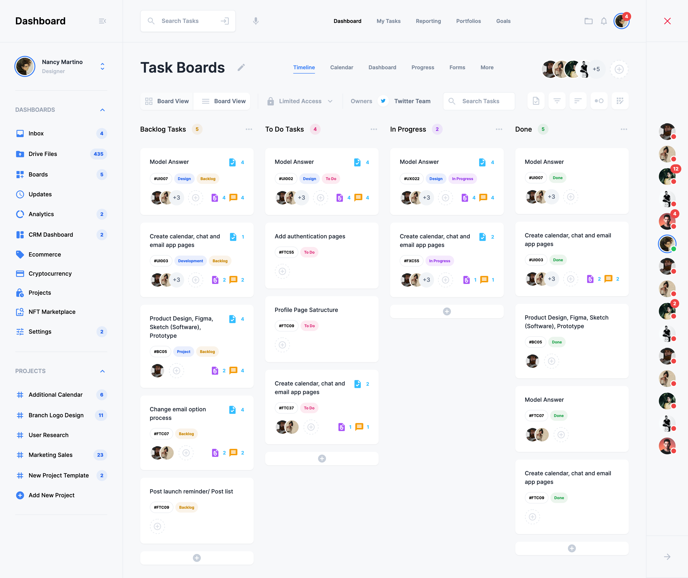

# Dashboard UI

#### [Website](https://dashboard-ui-x.vercel.app)



## Installation

1. Clone the repository
2. Run `npm install` to install the dependencies
3. Setup your .env file
4. Run `npm run dev` to start the development server
5. Run `npm run build` to build the project
6. Run `npm run start` to start the production server

## Node Version

> v18.13.0

## Technologies Used & Links

- [Next.js](https://nextjs.org/)
- [Typescript](https://www.typescriptlang.org/)
- [Tailwind CSS](https://tailwindcss.com/)
- [Prettier](https://prettier.io/)
- [Eslint](https://eslint.org/)

## Prettier and Eslint Commands

Prettier Check
```bash
npx prettier --check .
```

Prettier Write
```bash
npx prettier --write .
```

Eslint Check
```bash
npx elsint .
```

Eslint Fix
```bash
npx eslint --fix .
```
